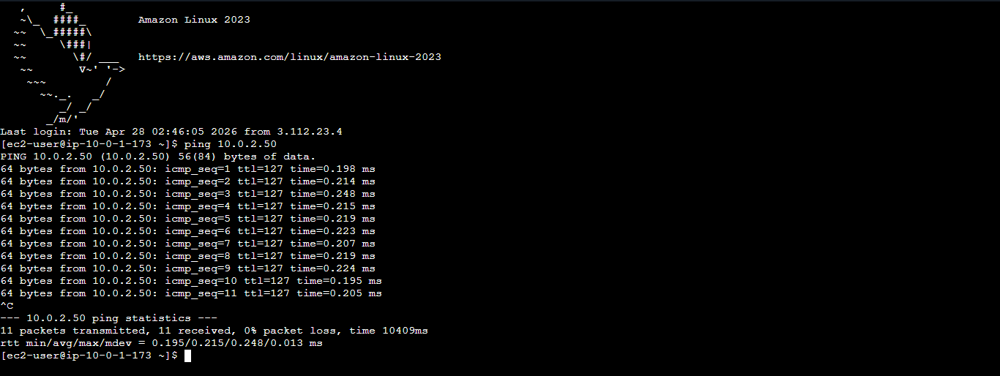
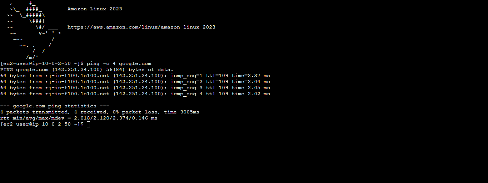
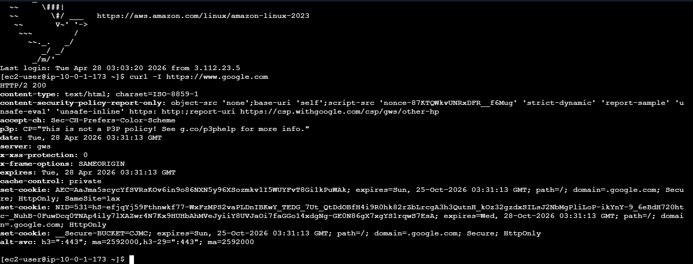

# AWS Hybrid Multi-Tier Infrastructure: High Availability & Secure Connectivity

## 📌 Project Overview
This project demonstrates a production-grade AWS environment featuring a 3-tier architecture with hybrid connectivity. I implemented a **Site-to-Site VPN** to bridge a simulated corporate data center to the cloud and established **VPC Peering** for cross-departmental data sharing. The architecture is designed for **High Availability (HA)** using Auto Scaling Groups.

## 🏗️ Architecture Diagram

> **Note on Topology:** While the diagram provides a logical overview of the component relationships, the implementation utilizes a multi-AZ deployment strategy for the Auto Scaling Groups to ensure high availability within the `ap-northeast-1` (Tokyo) region.

## 🛠️ Key Technical Features
* **Region:** Asia Pacific (Tokyo) / `ap-northeast-1`
* **High Availability:** Deployed **Auto Scaling Groups (ASG)** to manage instances across multiple Availability Zones, ensuring service resilience.
* **Hybrid Connectivity:** Configured an IPSec **Site-to-Site VPN** (`vpn-036f49f8b5136212e`) with **BGP Dynamic Routing** to connect with an on-premises Customer Gateway.
* **Network Isolation:** Utilized a **NAT Gateway** to allow private backend instances to access the internet for updates while remaining inaccessible from the public internet.
* **Inter-VPC Networking:** Established **VPC Peering** between the Production VPC (`10.0.0.0/16`) and a Partner VPC (`10.1.0.0/16`).
* **Storage Security:** Implemented an **S3 Gateway Endpoint**, ensuring traffic to Amazon S3 stays within the AWS private backbone.
* **Health Monitoring:** Integrated **ELB Health Checks** with the ASG to automatically replace unhealthy instances and maintain service availability.

## ✅ Connectivity & Security Validation
The integrity of the architecture was validated through the following technical tests:

### 1. Internal Tier Communication
Verified that the Public Web tier (`10.0.1.173`) could successfully reach the Private Backend tier (`10.0.2.50`) over ICMP, confirming Security Group chaining.

### 2. NAT Gateway Functionality
Confirmed that instances in the Private Subnet can reach external endpoints (e.g., `google.com`) for outbound requests without a public IP.

### 3. Cross-VPC Peering
Successfully validated pings to a simulated database instance (`10.1.1.187`) in the Partner Peer VPC, confirming route table and peering configurations.

### 4. Public Tier Availability
Verified the public-facing Web Server responses using `curl` to ensure the application tier is correctly handling traffic.

## 🔒 Security & Observability
* **Principle of Least Privilege:** Security Groups and NACLs were scoped to allow only strictly necessary traffic.
* **Network Logging:** Enabled **VPC Flow Logs** integrated with **CloudWatch** for real-time traffic monitoring and auditing.
* **Data Sanitization:** All sensitive identifiers (AWS Account IDs, IAM Usernames) have been removed from documentation and screenshots for public security.

## 📂 Repository Structure
* `/images`: Architectural diagrams and terminal verification screenshots.
* `/docs`: Technical configuration details (e.g., VPN BGP settings).
